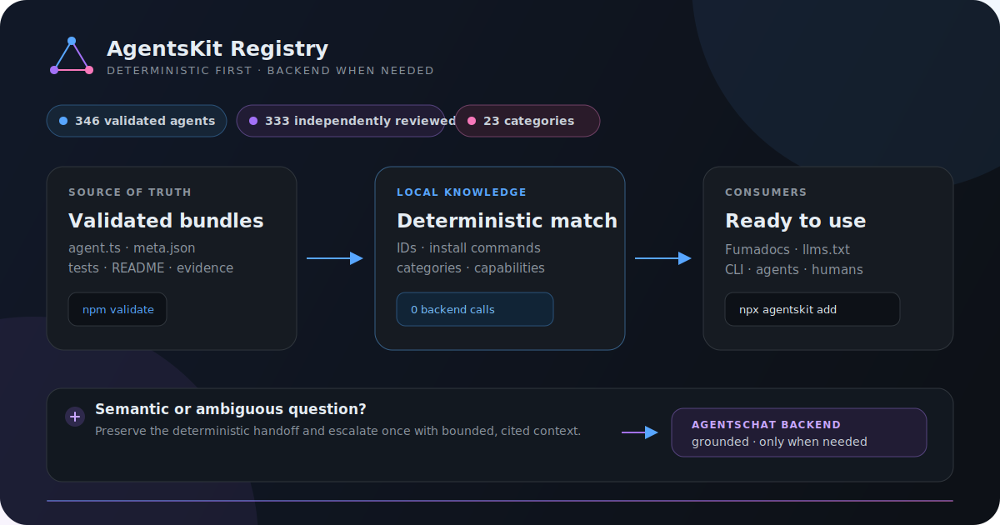
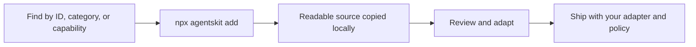

# AgentsKit Registry

Profile: <code>top-level-repository</code>

[](https://github.com/AgentsKit-io/agentskit-registry/actions/workflows/ci.yml)
[](https://registry.agentskit.io/agents)
[](./LICENSE)

**Copy a production-minded AI agent into your project and own the source.**
AgentsKit Registry is a shadcn-style catalog of 346 validated agents built with
[AgentsKit](https://www.agentskit.io/docs). It adds no Registry runtime and no
lock-in: the CLI copies readable TypeScript that your team can review and edit.

It is intended for teams that want a ready agent starting point without adopting
a proprietary registry runtime.

**Tags:** `agentskit` · `agent-registry` · `typescript` · `ai-agents` · `shadcn-style`

**Topics:** `ai-agents` · `registry` · `developer-experience`

[Browse the Registry](https://registry.agentskit.io/agents) ·
[Start in five minutes](./docs/getting-started.md) ·
[Contribute an agent](./CONTRIBUTING.md)



## Verified proof

- Catalog counts come from [`public/r/index.json`](./public/r/index.json) and [`ecosystem-claims.json`](./ecosystem-claims.json).
- Clean-fixture install/run contract: `npm run test:quickstart` (`scripts/quickstart.test.mjs`).
- Structural validation and Doc Bridge gates: `npm run validate`, `npm run docs:bridge:gate`.
- Deterministic discovery build: `npm run discovery:build`.
- Credential-free catalog proof: `node examples/verify-readme.mjs`.

## Validate agents in GitHub Actions

Use the Registry contract as a CI gate for copy-owned agent folders in another
repository. The action checks required source, test, metadata, and README files;
metadata IDs and referenced files; and the Registry content policy. It does not
send source code to an API or require credentials.

```yaml
name: Validate agents

on:
  pull_request:
  push:
    branches: [main]

jobs:
  agentskit:
    runs-on: ubuntu-latest
    steps:
      - uses: actions/checkout@v4
      - uses: AgentsKit-io/agentskit-registry@v1
        with:
          path: agents
```

The `path` input may point to one agent folder or to a directory whose immediate
children are agent folders.


> Registry is **beta**. All 346 entries pass structural and repository tests;
> 333 also publish sanitized independent-review evidence. Templates remain code
> you must review against your provider, tools, data policy, and risk profile.

## From catalog to code



<!-- readme-example:add-research -->
```bash
npx agentskit add research
```

```ts
import { openai } from '@agentskit/adapters'
import { createResearchAgent } from './agents/research/agent'

const agent = createResearchAgent({
  adapter: openai({
    apiKey: process.env.OPENAI_API_KEY!,
    model: 'gpt-4o',
  }),
})

const result = await agent.run('What changed in the EU AI Act?')
console.log(result.content)
```

Swap the adapter, tools, memory, model, and policy through supported AgentsKit
contracts. The copied factory stays ordinary application code.

## What is actually here

- **346 validated, installable agents** across 23 categories, from coding and
  security to legal, clinical, marketing, operations, support, and research.
- **333 independent-review summaries** with scores, confidence, strengths, and
  required adjustments; private raw reviewer output is never published.
- **Typed source + focused tests + usage guide** for every installable entry.
- **Eval replay fixtures** for repeatable behavioral checks without live keys.
- **JSON, `llms.txt`, MCP, and deterministic discovery artifacts** for people,
  tools, and LLMs to navigate the same canonical catalog.

Claims are derived from [`public/r/index.json`](./public/r/index.json) and the
generated [`ecosystem-claims.json`](./ecosystem-claims.json), not hand-maintained
marketing copy.

## Discovery without unnecessary backend calls

Exact agent IDs, titles, install commands, categories, capabilities,
contribution links, and ecosystem navigation resolve from a signed local
artifact. Semantic requests such as “which agent fits my incident workflow?”
escalate through AgentsKit Chat to the trusted cited backend only after a
validated local miss.

See [architecture and ownership](./docs/architecture.md) for the full boundary.

## Repository ownership

This repository owns catalog data and generated machine artifacts. The live
Fumadocs application and its AgentsChat presentation live in
[`AgentsKit-io/agentskit/apps/registry`](https://github.com/AgentsKit-io/agentskit/tree/main/apps/registry).
AgentsKit owns runtime primitives and the CLI; AgentsKit Chat owns the shared
answer protocol and renderer behavior. There is no second framework here.

## Contributing

New agents and improvements are welcome. Follow [CONTRIBUTING.md](./CONTRIBUTING.md),
use a neighboring validated agent as a reference, and run:

```bash
npm run validate
npm run lint
npm test
npm run eval:run -- --ecosystem-doc-bridge
npm run build
npm run docs:bridge:gate
```

Generated indexes, claims, deterministic artifacts, and Doc Bridge handoffs
must remain fresh in the pull request.

## Maturity

Registry is **beta**. All 346 entries pass structural and repository tests; 333
also publish sanitized independent-review evidence. Templates remain code you
must review against your provider, tools, data policy, and risk profile.

## AgentsKit ecosystem

- [AgentsKit](https://www.agentskit.io/docs) — build the agent runtime.
- **Registry** — start from owned, ready-made source.
- [AgentsKit Chat](https://github.com/AgentsKit-io/agentskit-chat) — deliver one
  agent experience across Web, native, and terminal interfaces.
- [Agents Playbook](https://playbook.agentskit.io/docs) — apply production
  engineering and review discipline.
- [Doc Bridge](https://github.com/AgentsKit-io/doc-bridge) — turn documentation
  into executable agent handoffs.
- [Code Review](https://github.com/AgentsKit-io/code-review-cli) — run deep,
  low-noise review with the model already in use.
- [AgentsKit OS](https://akos.agentskit.io/docs) — operate and govern agents.

## Compatibility and license

Registry source targets the package ranges declared by each `meta.json`; the
repository CI currently runs on Node.js 22. Review an agent's generated bundle
before upgrading its dependencies. Licensed under [MIT](./LICENSE).
