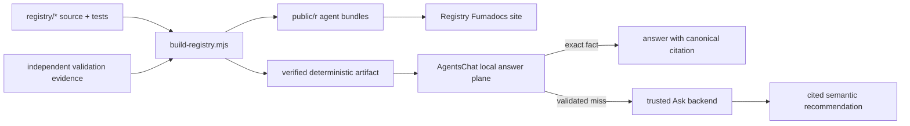

# Registry architecture and ownership

AgentsKit Registry is the source-owned catalog for ready-to-use AgentsKit
agents. It stores agent source, validation evidence, generated install bundles,
and the deterministic discovery artifact. The Fumadocs application in the
AgentsKit monorepo presents those artifacts; it is not a second catalog.

## Boundaries

- `registry/<id>` owns readable source, metadata, tests, eval fixtures, and the
  per-agent usage guide.
- `scripts/build-registry.mjs` owns committed install bundles, catalog indexes,
  `llms.txt`, and discovery artifacts. Generated files are never hand-edited.
- `@agentskit/chat/protocol` (AgentsKit Chat 0.3.x consolidated surface) owns
  artifact schemas, normalization, canonical serialization, limits, and
  SHA-256 verification. Registry does not fork it and does not ship a chat UI.
- AgentsKit CLI owns transactional `agentskit add`; Registry supplies the data.

## Upstream adoption (AgentsKit Chat 0.3)

| Record | Detail |
|--------|--------|
| Inspected | Published `@agentskit/chat@0.4.0` (`exports["./protocol"]`) |
| Reused exports | `LocalKnowledgeArtifactSchema`, `computeLocalKnowledgeArtifactContentHash`, `normalizeKnowledgeKey`, `verifyLocalKnowledgeArtifactSync`, protocol version constants, size limits |
| Local behavior | Registry only builds discovery entries + site config; no protocol schemas copied, no chat UI/runtime |
| Removed | `@agentskit/chat-protocol@0.2` dependency and imports |
| Pin | Exact `@agentskit/chat@0.4.0` (no caret) |
| Gate | `npm run check:no-legacy-chat-imports` (+ mechanical vitest) |
- AgentsChat owns exact lookup, local choice resolution, and safe escalation.
- The authenticated backend derives the corpus and persona server-side and
  requires grounded citations for semantic recommendations.

## Deterministic scope

The local artifact answers exact agent IDs and titles, install commands,
categories, declared capability tags, contribution paths, and ecosystem
navigation. It performs no fuzzy match, ranking, comparison, or recommendation.
Those semantic tasks escalate only after the local adapter produces a validated
low-confidence envelope.

The artifact is capped by the public protocol at 1,024 entries and 512 KiB.
Every committed build is schema-checked, content-hashed, and reproduced in CI.
